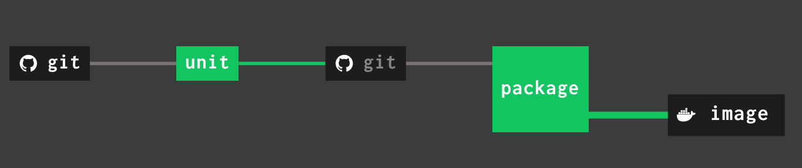

# hello-java

This is a small application that runs Undertow, as an embedded web server, to return a nice greeting.

I created this to use for as a simple test for pipelines, demos and other stuff.

## To compile and run

To compile the application and build a fat-jar (`jar-with-dependencies`):

    mvn clean package

Then, to run:

    java -jar target/hello-java-1.0.0-SNAPSHOT.jar

## To build a Docker image

To build and push an OCI (Docker) image - e.g. to run on Kubernetes - set your registry credentials in environment variables and run `jib:build` with the image repository that you want to push to:

    export REGISTRY_USERNAME=youruser@example.com
    export REGISTRY_PASSWORD=registrypassssssswd

    mvn compile jib:build -Djib.to.image=quay.io/youruser/yourimage:latest \
        -Djib.to.auth.username=$REGISTRY_USERNAME \
        -Djib.to.auth.password=$REGISTRY_PASSWORD

This uses [Google Jib][jib] to build the image. It doesn't build an executable JAR, but instead splits the build outputs into image layers (classes, libs, resources, etc.) and sets the container entrypoint to something like:

    java -cp /app/resources:/app/classes:/app/libs/* xyz.tomd.demos.hellorestjava.Application


## Kubernetes

### Helm chart

A Helm chart is included with this application. To deploy the app onto Kubernetes, first install the Helm client and then run:

    helm install mydemo hello-java

This will create a _Release_ of this app called `mydemo`:

    $ kubectl get pod -w
    NAME                                READY   STATUS    RESTARTS   AGE
    mydemo-hello-java-6fb5d686c-67lqw   0/1     Running   0          14s

## CI

### Jenkins on OpenShift

This application includes a sample pipeline for _Jenkins_, intended to be used with Jenkins on _OpenShift_.

To set it up:

1.  Fork this repo.

2.  Deploy Jenkins from the OpenShift application catalogue.

3.  Create a _Pipeline_ job, choose _Pipeline source from SCM_ and configure the URL to this repo (or your own fork, if you've forked this repo.)

4.  Edit the `openshift-build.yml` file and set the Build target to point to the registry where you want to push the finished image, e.g.:

        output:
            to:
                kind: DockerImage
                name: docker.io/YOURUSERNAME/hello-java:latest

5.  Create a BuildConfig object, in the same namespace as Jenkins:

        oc apply -f openshift-build.yml

6.  Add a secret to authenticate to your external registry and link it to the `builder` service account:

        oc create secret docker-registry my-secret \ 
            --docker-server=docker.io \
            --docker-username=YOURUSERNAME \ 
            --docker-password=xxx \ 

        oc secrets link builder my-secret --for=mount

7.  Run the pipeline in Jenkins.

### Concourse CI

This application includes a sample pipeline for _Concourse CI_ that builds a Docker image with [Jib][jib] and pushes it to an external registry.

When finished, it looks like this:



#### Set up the pipeline

Set up concourse credentials, and log in:

```
export CONCOURSE_EXTERNAL_URL=https://concourse.eggworld.example.com
export CONCOURSE_USER=username
export CONCOURSE_PASSWORD=password

fly -t tutorial login -k -c ${CONCOURSE_EXTERNAL_URL} \
    -u ${CONCOURSE_USER} -p ${CONCOURSE_PASSWORD}
```

Now configure your username and password for the container registry so that Jib can push the Docker image when it's built (I'm using Quay.io):

```
export REGISTRY_USERNAME=your-quay-username
export REGISTRY_PASSWORD=your-quay-password
```

Next, create the pipeline, setting your registry credentials as variables (`-v`):

```
fly -t tutorial set-pipeline -c ci/concourse/pipeline.yml -p hello-java \
    -v registry-username=${REGISTRY_USERNAME} \
    -v registry-password=${REGISTRY_PASSWORD} \
    -v image-name=yourregistry.example.com/youruser/hello-java
```

**NB:** This demo pipeline uses simple variable interpolation. This means that these sensitive credentials are set explicitly in the pipeline when you run `fly set-pipeline`. For a production setup, you should fetch credentials from something like _Vault_ instead.

#### Run the pipeline

Now unpause the pipeline - it will turn grey:

```
fly -t tutorial unpause-pipeline -p hello-java
```

Finally run the job in the web console, make a Git commit, or run it from the command line and follow the logs:

```
fly -t tutorial trigger-job -j hello-java/unit --watch
```

#### Optionally deploy the application to OpenShift

You can deploy the application to OpenShift using the template provided in openshift-template.yml. You'll need to configure the template with the full image spec where OpenShift can find the image:

```
oc new-project my-project

oc process -f openshift-template.yml \
    -p IMAGE=yourregistry.example.com/youruser/hello-java \
    | oc apply -f -
```

Now whenever the pipeline runs and pushes a new image, the application will be updated in OpenShift (when OpenShift notices the updated tag, which can take around 15 minutes).

[jib]: https://github.com/GoogleContainerTools/jib
